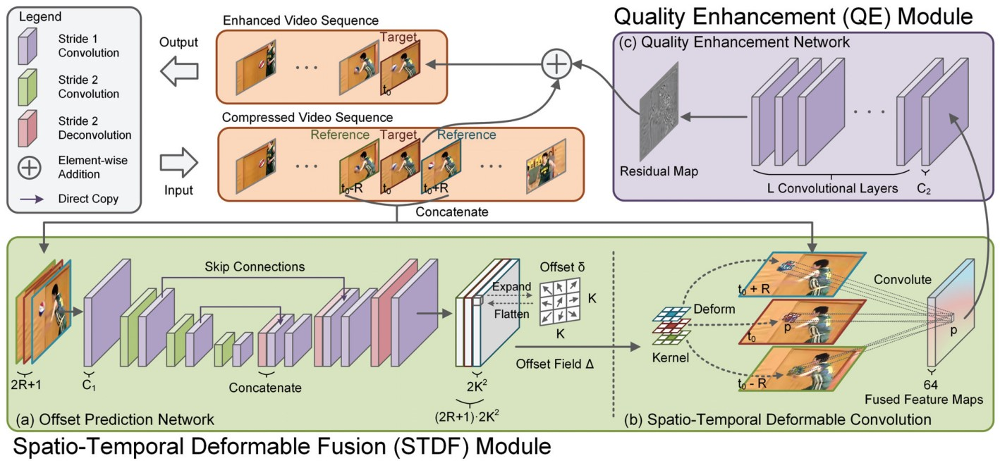

# Spatio-Temporal Deformable Convolution for Compressed Video Quality Enhancement (AAAI 2020)

- [Spatio-Temporal Deformable Convolution for Compressed Video Quality Enhancement (AAAI 2020)](#spatio-temporal-deformable-convolution-for-compressed-video-quality-enhancement-aaai-2020)
  - [0. Background](#0-background)
  - [1. Pre-request](#1-pre-request)
    - [1.1. Environment](#11-environment)
    - [1.2. DCNv2](#12-dcnv2)
    - [1.3. MFQEv2 dataset](#13-mfqev2-dataset)
  - [2. Train](#2-train)
  - [3. Test](#3-test)
  - [4. Results](#4-results)
  - [5. Q&A](#5-qa)
  - [6. License & Citation](#6-license--citation)
  - [7. See more](#7-see-more)

## 0. Background

PyTorch implementation of [Spatio-Temporal Deformable Convolution for Compressed Video Quality Enhancement](https://www.aiide.org/ojs/index.php/AAAI/article/view/6697) (AAAI 2020).

- A **simple** yet **effective** video quality enhancement network.
- Adopt **feature alignment** by multi-frame **deformable convolutions**, instead of motion estimation and motion compensation.

**Notice**: The dataset and training method are different from those in the original paper.



(Figure copyright: Jianing Deng)

Feel free to contact: ryanxingql@gmail.com.

## 1. Pre-request

### 1.1. Environment

- Ubuntu 20.04/18.04
- CUDA 10.1
- PyTorch 1.6
- Packages: tqdm, lmdb, pyyaml, opencv-python, scikit-image

Suppose that you have installed CUDA 10.1, then:

```bash
$ git clone --depth=1 https://github.com/RyanXingQL/STDF-PyTorch 
$ cd STDF-PyTorch/
$ conda create -n stdf python=3.7 -y
$ conda activate stdf
$ python -m pip install torch==1.6.0+cu101 torchvision==0.7.0+cu101 -f https://download.pytorch.org/whl/torch_stable.html
$ python -m pip install tqdm lmdb pyyaml opencv-python scikit-image
```

### 1.2. DCNv2

**Build DCNv2.**

```bash
$ cd ops/dcn/
$ bash build.sh
```

**(Optional) Check if DCNv2 works.**

```bash
$ python simple_check.py
```

> The DCNv2 source files here is different from the [open-sourced version](https://github.com/chengdazhi/Deformable-Convolution-V2-PyTorch) due to incompatibility. [[issue]](https://github.com/open-mmlab/mmediting/issues/84#issuecomment-644974315)

### 1.3. MFQEv2 dataset

**Download the raw dataset.**

Download link: [[DropBox]](https://www.dropbox.com/sh/d04222pwk36n05b/AAC9SJ1QypPt79MVUZMosLk5a?dl=0)

For Chinese researchers: [[百度网盘]](https://pan.baidu.com/s/1oBZf75bFGRanLmQQLAg4Ew), 提取码mfqe)

> MFQEv2 dataset includes 108 lossless YUV sequences for training, and 18 test sequences recommended by ITU-T.

**Compress both training and test sequences by HM16.5 at LDP mode, QP=37.**

We have also provided the video compression toolbox in the dataset link.

First edit `option.yml` in `video_compression/`, i.e., `dir_dataset` and `qp`.

Then run:

```bash
$ cd video_compression/
$ chmod +x TAppEncoderStatic
$ python unzip_n_compress.py
```

Finally, we will get:

```tex
MFQEv2_dataset/
├── train_108/
│   ├── raw/
│   └── HM16.5_LDP/
│       └── QP37/
├── test_18/
│   ├── raw/
│   └── HM16.5_LDP/
│       └── QP37/
├── video_compression/
│   └── ...
└── README.md
```

**Edit `option_R3_mfqev2_4G.yml`.**

Suppose the folder `MFQEv2_dataset/` is placed at `/raid/xql/datasets/MFQEv2_dataset/`, then you should assign `/raid/xql/datasets/MFQEv2_dataset/` to `dataset -> train -> root` in YAML.

> `R3`: one of the network structures provided in the paper; `mfqev2`: MFQEv2 dataset will be adopted; `4G`: 4 GPUs will be used for the below training. Similarly, you can also edit `option_R3_mfqev2_1G.yml` and `option_R3_mfqev2_2G.yml` if needed.

**Generate LMDB to speed up IO during training.**

```bash
$ python create_lmdb_mfqev2.py --opt_path option_R3_mfqev2_4G.yml
```

Now you will get all needed data:

```tex
MFQEv2_dataset/
├── train_108/
│   ├── raw/
│   └── HM16.5_LDP/
│       └── QP37/
├── test_18/
│   ├── raw/
│   └── HM16.5_LDP/
│       └── QP37/
├── mfqev2_train_gt.lmdb/
└── mfqev2_train_lq.lmdb/
```

Finally, the MFQEv2 dataset root will be sym-linked to the folder `./data/` automatically.

> So that we and programmes can access MFQEv2 dataset at `./data/` directly.

## 2. Train

See `script.sh`.

## 3. Test

**Test After Training**

See `script.sh`.

**Test Without Training**

If you did not run `create_lmdb` for training, you should first sym-link MFQEv2 dataset to `./data/`.

```bash
$ mkdir data/
$ ln -s /your/path/to/MFQEv2_dataset/ data/MFQEv2
```

Download the pre-trained model: [[Google Drive]](https://drive.google.com/drive/folders/17gTXSnyiDp12wcGH_qtekLtBBU9s_WGM?usp=sharing) (For Chinese researchers: [[百度网盘]](https://pan.baidu.com/s/1I-c95lJYLNmIQALzqelWYA), 提取码stdf)

**Simply Test One Video**

First download the pre-trained model, and then run:

```bash
$ CUDA_VISIBLE_DEVICES=0 python test_one_video.py
```

See `test_one_video.py` for more details.

## 4. Results

```log
loading model exp/MFQEv2_R3_enlarge300x/ckp_290000.pt...
> model exp/MFQEv2_R3_enlarge300x/ckp_290000.pt loaded.

<<<<<<<<<< Results >>>>>>>>>>
BQMall_832x480_600.yuv: [31.297] dB -> [32.221] dB
BQSquare_416x240_600.yuv: [28.270] dB -> [29.078] dB
BQTerrace_1920x1080_600.yuv: [31.247] dB -> [31.852] dB
BasketballDrill_832x480_500.yuv: [31.591] dB -> [32.359] dB
BasketballDrive_1920x1080_500.yuv: [33.227] dB -> [33.963] dB
BasketballPass_416x240_500.yuv: [30.482] dB -> [31.446] dB
BlowingBubbles_416x240_500.yuv: [27.794] dB -> [28.465] dB
Cactus_1920x1080_500.yuv: [32.207] dB -> [32.918] dB
FourPeople_1280x720_600.yuv: [34.589] dB -> [35.533] dB
Johnny_1280x720_600.yuv: [36.375] dB -> [37.161] dB
Kimono_1920x1080_240.yuv: [34.411] dB -> [35.272] dB
KristenAndSara_1280x720_600.yuv: [35.887] dB -> [36.895] dB
ParkScene_1920x1080_240.yuv: [31.583] dB -> [32.140] dB
PartyScene_832x480_500.yuv: [27.802] dB -> [28.402] dB
PeopleOnStreet_2560x1600_150.yuv: [31.388] dB -> [32.557] dB
RaceHorses_416x240_300.yuv: [29.320] dB -> [30.055] dB
RaceHorses_832x480_300.yuv: [30.094] dB -> [30.557] dB
Traffic_2560x1600_150.yuv: [33.176] dB -> [33.866] dB
> ori: [31.708] dB
> ave: [32.486] dB
> delta: [0.778] dB
TOTAL TIME: [0.2] h
```

## 5. Q&A

> Train and test on Vimeo-90K dataset.

You should download the Vimeo-90K dataset, convert these PNG sequences into 7-frame YCbCr YUV444P videos, then compress these videos under QP37, All Intra, HM16.5. We also provide one-click programme at [[Google Drive]](https://drive.google.com/drive/folders/17gTXSnyiDp12wcGH_qtekLtBBU9s_WGM?usp=sharing) (For Chinese researchers: [[百度网盘]](https://pan.baidu.com/s/1I-c95lJYLNmIQALzqelWYA), 提取码stdf).

```tex
Vimeo-90K/
├── vimeo_septuplet/
│   └── ...
├── vimeo_septuplet_ycbcr/
│   └── ...
└── vimeo_septuplet_ycbcr_intra/
    └── ...
```

The LMDB preparation, option YAML, training and test codes have been already provided in this repository.

> The epoch index starts from 0, while the iter index (also model index) starts from 1.

Small bug. I will fix it some time.

> How do we enlarge the dataset?

Following BasicSR, we set `sampling index = target index % dataset len`.

For example, if we have a dataset which volume is 4 and enlargement ratio is 2, then we will sample images at indexes equal 0, 1, 2, 3, 0, 1, 2, 3. Note that at each sampling, we will randomly crop the image. Therefore, the patches cropped at the same image but different times can be different.

Besides, the data loader will be shuffled at the start of each epoch. Enlarging epoch can help reduce the total starting times.

> Why do we set the number of iteration but not epoch?

Considering that we can enlarge the dataset with various ratio, the number of epoch is meaningless. In the meanwhile, the number of iteration indicates the number of sampling batches, which is more meaningful to us.

## 6. License & Citation

You can **use, redistribute, and adapt** the material for **non-commercial purposes**, as long as you give appropriate credit by **citing the following paper** and **indicating any changes** that you've made.

```tex
@inproceedings{STDF,
  title={Spatio-Temporal Deformable Convolution for Compressed Video Quality Enhancement},
  author={Deng, Jianing and Wang, Li and Pu, Shiliang and Zhuo, Cheng},
  booktitle={Proceedings of the AAAI Conference on Artificial Intelligence},
  volume={34},
  number={07},
  pages={10696--10703},
  year={2020}
}
```

Special thanks to:

- Jianing Deng (邓家宁, the author of STDF): network structure and training details.
- [BasicSR](https://github.com/xinntao/BasicSR): useful tools and functions.

## 7. See more

- [MFQEv2 (TPAMI 2019)](https://github.com/RyanXingQL/MFQEv2.0)
  - The first **multi-frame** quality enhancement approach for compressed videos.
  - The first to consider and utilize the **quality fluctuation** feature of compressed videos.
  - Enhance low-quality frames using **neighboring high-quality** frames.

- [RBQE (ECCV 2020)](https://github.com/RyanXingQL/RBQE)
  - A **single blind** enhancement model for HEVC/JPEG-compressed images with a **wide range** of Quantization Parameters (QPs) or Quality Factors (QFs).
  - A **multi-output dynamic** network with **early-exit** mechanism for easy input.
  - A **Tchebichef-moments** based **NR-IQA** approach for early-exit decision. This IQA approach is highly interpretable and sensitive to blocking energy detection.
